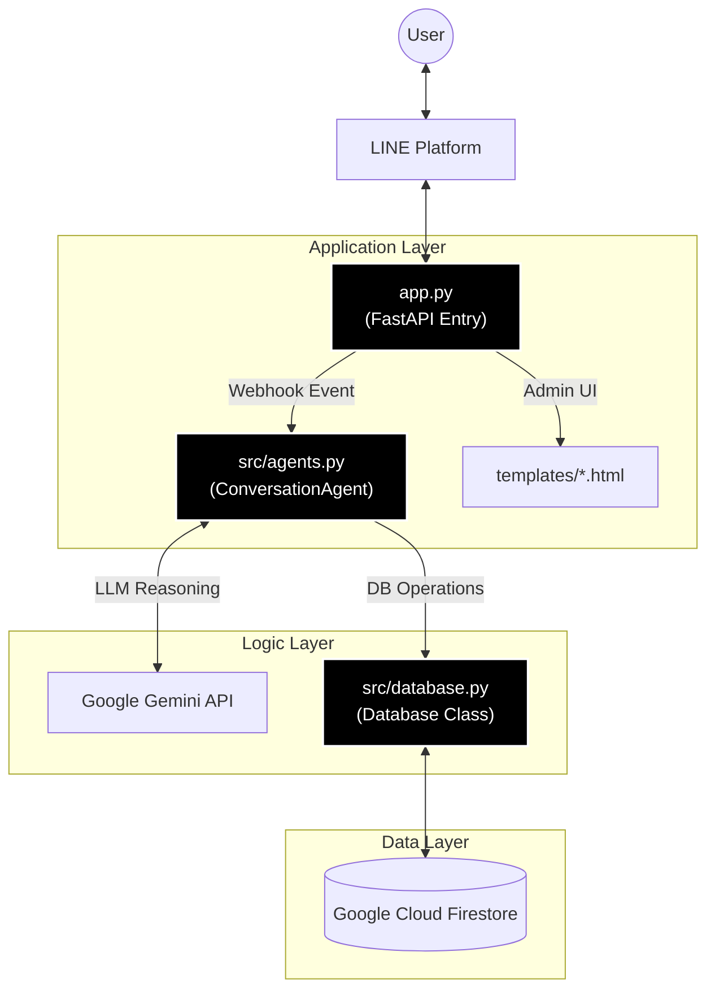

# Project Architecture: Coffee Shop AI Agent

這份文件概述了 Coffee Shop Agent 的系統架構、程式碼組織以及核心邏輯。

## 1. 專案概述 (Project Overview)
本專案是一個結合 **LINE Bot**、**Google Gemini AI** 與 **Google Firestore** 的智慧餐廳訂位系統。
系統旨在透過自然語言對話，自動化處理客人的訂位需求，並具備複雜的座位管理邏輯（如樓層偏好、自動併桌、跨樓層拆桌詢問等）。

### 技術堆疊 (Tech Stack)
- **Backend Framework**: FastAPI (Python)
- **AI Model**: Google Gemini-1.5-pro / Gemini-2.0-flash
- **Database**: Google Cloud Firestore (NoSQL)
- **Interface**: LINE Messaging API
- **Deployment**: Google Cloud Run

---

## 2. 模組相依圖 (Module Dependency Graph)

---

## 3. 核心模組與函式說明 (Key Modules & Functions)

### 📂 `app.py` (Application Entry)
負責處理 HTTP 請求、路由分派以及與 LINE 平台的對接。

*   **`callback()`**: Webhook 的主要入口。負責驗證 LINE 簽章 (Signature) 並解析事件 (Event)。
*   **`handle_message()`**: 處理文字訊息事件。將使用者的訊息轉發給 `ConversationAgent` 處理，並將結果回覆給使用者。
*   **`handle_follow_async()`**: 處理新加入好友事件，發送歡迎訊息。
*   **`seating_map()` (Route)**: 產生動態座位圖的 HTML 頁面。會計算每個訂位的顏色編碼，供前端視覺化使用。

### 📂 `src/agents.py` (AI Logic Layer)
負責「大腦」的部分，整合 LLM 進行語意理解、意圖判斷與工具呼叫。

*   **`ConversationAgent` Class**:
    *   **`process(input_text, context)`**: 核心處理迴圈。
        - 構建 System Prompt (注入最新的 Menu, Policy, User Info)。
        - 呼叫 Gemini API。
        - 處理 **Function Calling** (如 `book_table`, `modify_reservation`)。
        - 處理 **系統攔截邏輯** (如：客人說「沒有了」即自動結束對話)。
    *   **`book_table(...)`**: **[關鍵邏輯]** 提供給 LLM 呼叫的訂位工具。
        - **Pre-check**: 在寫入資料庫前，先呼叫 `db.get_available_floors` 檢查指定樓層是否客滿。
        - **Negotiation**: 若需協商 (如樓層客滿或需跨樓層)，回傳 `SYSTEM_NOTICE` 指示 LLM 詢問使用者。
        - **Finalize**: 呼叫 `db.create_reservation` 執行寫入，並產生格式化的成功訊息 (含座位連結)。

### 📂 `src/database.py` (Data & Algorithm Layer)
負責與 Firestore 互動，並實作複雜的座位分配演算法。

*   **`Database` Class**:
    *   **`create_reservation(...)`**: **[核心演算法]**
        - 使用 Firestore Transaction 確保資料一致性。
        - **Table Allocation Strategy (座位分配策略)**:
            1. **Compactness**: 優先填滿剛好的人數空缺。
            2. **Floor Preference**: 優先滿足使用者的樓層偏好。
            3. **Multi-table (Same Floor)**: 若單桌塞不下，優先在同樓層併桌。
            4. **Global Greedy (Cross-floor)**: 若同樓層滿了，且 `allow_split_floor=True`，則跨樓層分配；否則拋出 `split_floor_required` 例外。
    *   **`get_available_floors(...)`**:
        - 模擬計算所有座位，回傳各樓層是否還有足夠容納 `pax` 的剩餘空間。
    *   **`check_availability(...)`**:
        - 檢查特定日期的總剩餘容量，並考慮特殊公休日 (Special Closures)。

---

## 4. 關鍵流程分析 (Key Workflows)

### 流程一：智慧訂位與樓層協商 (Booking with Negotiation)
這是一個展示 Agent 與 Database 協同合作的複雜案例。

1.  **Intent**: 使用者說「訂 5 位，要 2 樓」。
2.  **Reasoning**: LLM 判斷呼叫 `book_table(pax=5, floor=2)`.
3.  **Pre-check**: `book_table` 呼叫 `db.get_available_floors`.
    *   *Case A (2F Available)*: 直接呼叫 `db.create_reservation` -> 成功。
    *   *Case B (2F Full, 3F Available)*: `book_table` 回傳 System Notice -> LLM 轉述：「2樓滿了，3樓可以嗎？」
4.  **User Response**: 使用者回「好，3樓也可以」。
5.  **Action**: LLM 再次呼叫 `book_table(..., floor=3)`.
6.  **Execution**: 訂位成功。

### 流程二：跨樓層拆桌 (Split Floor Booking)
當單一樓層都無法容納大組客人時的流程。

1.  **Intent**: 使用者說「訂 8 位」。
2.  **Advice**: LLM 呼叫 `book_table(pax=8)`.
3.  **Execution Fail**: `db.create_reservation` 發現單層樓都塞不下，拋出 `split_floor_required`.
4.  **Feedback**: `book_table` 捕捉例外，回傳 System Notice -> LLM 轉述：「單層樓沒位子，能接受分開在 2F 和 3F 嗎？」
5.  **User Confirmation**: 使用者回「沒關係，可以」。
6.  **Retry**: LLM 再次呼叫 `book_table(..., allow_split=True)`.
7.  **Final Execution**: `db.create_reservation` 啟用 Global Greedy 模式，成功跨樓層訂位。

---

## 5. 無狀態與快取設計 (Stateless & Caching)
- **Agent State**: `ConversationAgent` 維持短期的 `chat_histories` (記憶體中)，但在 Cloud Run 環境下可能會因重啟而重置，因此設計上依賴 System Prompt 每次注入關鍵 User Info (Name, Phone)。
- **Helpers**: 支援 `reset_and_repair.py` 與 `verify_data.py` 等工具腳本，用於開發維運時快速重置資料庫狀態。
